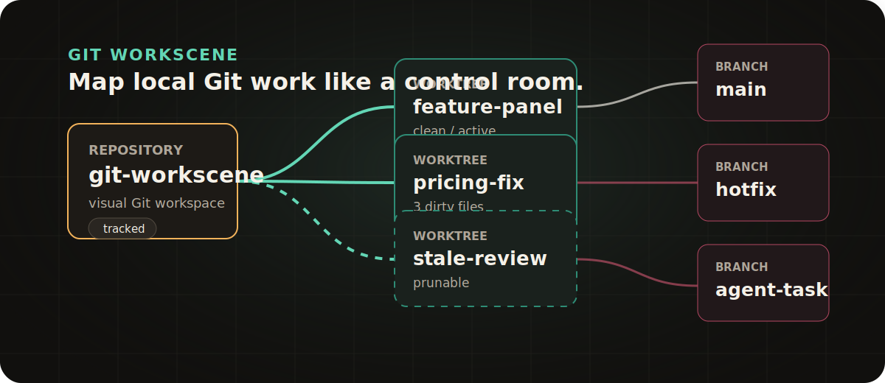

<p align="center">
  
</p>

<h1 align="center">Git Workscene</h1>

<p align="center">
  A visual desktop workspace for local Git repositories, branches, worktrees, stashes, and file changes.
</p>

<p align="center">
  <a href="https://github.com/Jamt1n/git-workscene/actions/workflows/ci.yml"></a>
  <a href="https://github.com/Jamt1n/git-workscene/releases"></a>
  <a href="LICENSE"></a>
  
</p>



Git Workscene turns local Git work into a map. It is built for developers who keep multiple repositories, worktrees, and AI-assisted tasks running in parallel, and want a calmer way to see what is checked out, dirty, stale, ahead, behind, or ready to clean.

## Highlights

- Add a single Git repository or a whole workspace folder and discover child repositories.
- See repositories, worktrees, active branches, stashes, dirty files, and branch relationships on one canvas.
- Checkout branches, create worktrees, pull, push, fetch, stash, and open paths in Finder, Terminal, or editor.
- Inspect dirty file changes before switching context.
- Review branch commits and compare local history with the tracked remote branch.
- Preview destructive actions before deleting worktrees or branches.
- Clean local branches that are already merged into the repository default branch.
- Drag repositories in the sidebar to keep your working set in your own order.
- Check for signed app updates from GitHub Releases.

## Product Principles

- **Local first.** The app reads your local Git state and does not require a hosted Git provider.
- **Safety first.** Destructive Git operations show an explicit preview before they run.
- **No mystery automation.** Fetch, pull, push, checkout, cleanup, and update installation stay user-triggered.
- **Worktree aware.** Main working trees are protected, stale metadata is detected, and prunable worktrees are surfaced clearly.
- **Built for parallel work.** The UI is optimized for many small task branches, not just one linear history.

## Download

Download the latest signed builds from [GitHub Releases](https://github.com/Jamt1n/git-workscene/releases/latest).

Current release assets include:

- macOS Apple Silicon and Intel DMG bundles
- Windows NSIS and MSI installers
- Linux AppImage, Debian, and RPM packages
- Tauri updater metadata and signatures

If macOS blocks the app after installation, remove the quarantine attribute:

```bash
sudo xattr -dr com.apple.quarantine /Applications/Git\ Workscene.app
```

## Development

Requirements:

- Node.js 20 or newer
- Rust stable
- Git
- Tauri platform prerequisites for your operating system

Install and run:

```bash
npm ci
npm run tauri dev
```

Run checks:

```bash
npm test
npm run build
cargo test --manifest-path src-tauri/Cargo.toml
```

Build a local app bundle:

```bash
npm run tauri build -- --bundles app
```

## Releases and Updates

GitHub Actions builds desktop bundles and Tauri updater artifacts for every `v*` tag. The updater endpoint is backed by the latest GitHub Release:

```text
https://github.com/Jamt1n/git-workscene/releases/latest/download/latest.json
```

See [docs/UPDATES.md](docs/UPDATES.md) for the release checklist and signing-key setup.

## Contributing

Issues and pull requests are welcome. Please read [CONTRIBUTING.md](CONTRIBUTING.md) before opening a PR.

## License

MIT. See [LICENSE](LICENSE).
