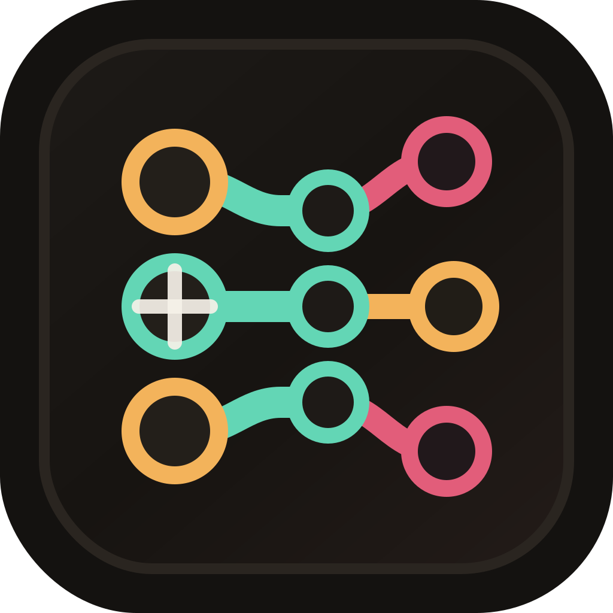

# Git Workscene

[](https://github.com/Jamt1n/git-workscene/actions/workflows/ci.yml)

Git Workscene is a visual desktop workspace for local Git repositories, branches, worktrees, stashes, and dirty file changes. It is built for developers who run several parallel coding tasks and need a safer way to understand what each local workspace is doing.



## Highlights

- Add one repository or a whole workspace folder and discover child Git repositories.
- See repositories, worktrees, active branches, local branch state, stashes, and dirty file changes in one graph.
- Checkout branches, create worktrees, pull, push, fetch, stash, and open paths in Finder, Terminal, or editor.
- Preview destructive actions before deleting worktrees or branches.
- Clean local branches merged into the repository default branch.
- Compare local branch commits with their tracked remote branch.
- Drag repositories in the sidebar to keep your working set ordered.
- Check for app updates from GitHub Releases.

## Safety Model

Git Workscene favors explicit actions over hidden automation:

- destructive Git operations show a confirmation preview first;
- cleanup operations fetch the latest remote default branch before deciding what is safe;
- the main working tree is protected from worktree removal;
- stale worktree metadata can be pruned only after validation;
- update installation is user-triggered from the app.

## Development

Requirements:

- Node.js 20 or newer
- Rust stable
- Git
- Tauri platform prerequisites for your OS

Install and run:

```bash
npm ci
npm run tauri dev
```

Run checks:

```bash
npm test
npm run build
cargo test --manifest-path src-tauri/Cargo.toml
```

Build a local app bundle:

```bash
npm run tauri build -- --bundles app
```

## Releases and Updates

GitHub Actions builds release bundles and Tauri updater artifacts. See [docs/UPDATES.md](docs/UPDATES.md) for the signing keys and release checklist.

## Contributing

Issues and pull requests are welcome. Please read [CONTRIBUTING.md](CONTRIBUTING.md) before opening a PR.

## License

MIT. See [LICENSE](LICENSE).
