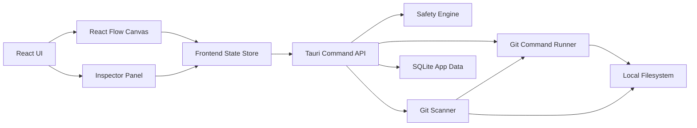

# Git Worktree Visual Manager Design

Date: 2026-05-26
Status: Draft for user review

## Summary

Build a macOS-first Tauri desktop app for managing local Git repositories, branches, and worktrees through a full-screen visual canvas. The app is AI-agnostic, but it is optimized for the AI-development pain point of running many parallel task branches and worktrees at the same time.

The product should answer these questions at a glance:

- Which repos am I actively working in?
- Which task branches have worktrees?
- Which worktrees are dirty, stale, ahead, behind, or safe to clean up?
- Which branches are merged, unmerged, pushed, unpushed, or blocked by an attached worktree?
- What can I safely open, push, stash, delete, or clean up right now?

The first release is a real usable MVP, not a pure mockup. It scans real local repositories and performs real Git operations, while all risky operations go through a preview and confirmation model. Destructive testing is done against generated sandbox repositories.

## Goals

- Manage multiple local Git repositories from one desktop app.
- Support manual repo add, directory drag-and-drop, and scanning common local directories.
- Represent repos, worktrees, branches, remotes, dirty states, and cleanup candidates on a full-screen canvas.
- Treat worktrees as first-class entities instead of burying them under branch menus.
- Provide safe execution for Git operations, including destructive operations.
- Keep the product AI-agnostic while making AI-era parallel branch/worktree workflows feel natural.
- Start with macOS-first polish while keeping the architecture portable enough for future Windows/Linux support.

## Non-Goals

- Do not build an AI agent manager in the first version.
- Do not build a full GitKraken/Fork/Tower replacement in the first version.
- Do not implement PR-platform login or deep GitHub/GitLab integration initially.
- Do not build an in-app code editor or full diff editor.
- Do not automate cleanup without explicit user confirmation.
- Do not build cloud sync or team collaboration in the first version.

## Product Direction

Traditional Git desktop clients center the experience around a single repository's commit graph. This app centers the experience around the user's current local work scene:

```text
GitKraken-style model:
repo -> commit graph -> branches/worktrees

This app:
global work scene -> repo/worktree/branch topology -> commits as detail/evidence
```

The app should borrow useful patterns from GitKraken, especially grouped navigation, status counts, quick actions, and visual branch state. It should avoid making the commit graph the dominant surface. The first visual priority is knowing where active work lives and what state it is in.

## Recommended Approach

Use the "real usable MVP with flagship interaction skeleton" approach.

Rejected alternatives:

- Pure interaction prototype first: faster to polish visually, but Git reality would be delayed and might invalidate core interactions later.
- Complete Git GUI replacement first: too broad and likely to dilute the main worktree-management advantage.

The MVP should be narrow but real: multi-repo scanning, worktree visualization, core Git operations, safety previews, and sandbox tests.

## Technology Stack

- Desktop shell: Tauri v2
- Frontend: React + TypeScript
- Canvas graph: React Flow
- UI system: Tailwind CSS + shadcn/ui + Radix primitives
- Icons: Lucide
- Backend: Rust Tauri commands
- Local persistence: SQLite in Tauri app data
- Git execution: system `git` binary through Rust command layer

React Flow is preferred over graph-analysis libraries because the product needs rich custom nodes, cards, badges, controls, hover states, selection, and inspector-driven interaction. Cytoscape.js remains a future fallback if very large graph analysis becomes the dominant problem.

## Architecture



Frontend code submits structured intents to the backend. It does not concatenate shell commands. Example intents:

- `AddRepository`
- `ScanRepository`
- `CreateWorktree`
- `DeleteWorktreePreview`
- `DeleteWorktreeExecute`
- `DeleteBranchPreview`
- `DeleteBranchExecute`
- `FetchRepository`
- `PullWorktree`
- `PushBranch`
- `StashWorktree`

The Rust backend owns path validation, repo validation, Git command construction, and safety checks.

## Core Modules

### Repo Registry

Tracks repositories known to the app.

Responsibilities:

- Add a repository from a selected directory.
- Add repositories via drag-and-drop.
- Scan common parent directories for Git repositories.
- Persist repo path, display name, last scan time, user-pinned status, and layout preferences.
- Detect invalid or moved repositories during refresh.

### Git Scanner

Reads repository state through stable Git commands.

Primary data:

- Repository root and common Git dir.
- Worktree list from `git worktree list --porcelain -z`.
- Local branches from `git for-each-ref`.
- Remote branches and upstream relation.
- Ahead/behind counts.
- Dirty status from porcelain status.
- Stashes.
- Merged and unmerged branch state.
- Current branch, detached HEAD, and last commit per worktree.

The scanner should return structured data and avoid exposing raw command output to the UI except inside diagnostic details.

### Graph Model

Transforms Git scanner output into canvas nodes and edges.

Node types:

- Repository node
- Worktree node
- Local branch node
- Remote branch node
- Stash node
- Status/risk summary node, if useful for dense repos

Edge types:

- Repository owns worktree
- Worktree checks out branch
- Local branch tracks remote branch
- Branch has stash or dirty work
- Branch/worktree is cleanup candidate

### Command Runner

Executes Git actions through a typed backend interface.

Each command returns:

- Success/failure status
- Human-readable summary
- Raw command for copy/debug display
- Updated scan target recommendation
- Structured error classification where useful

### Safety Engine

Generates impact previews and blocks unsafe operations when the user intent cannot be honored safely.

Examples:

- Deleting a worktree previews its path, branch, dirty status, untracked files, and whether Git considers it locked.
- Deleting a branch previews merged status, upstream status, ahead/behind, attached worktree status, and last commit.
- Reset/clean previews affected files before execution.
- Force push is high risk and requires explicit confirmation.

The app can implement all Git operations, including dangerous ones, but high-risk operations must not execute without preview and confirmation.

### Canvas UI

Main full-screen graph surface.

Core interactions:

- Pan and zoom.
- Semantic zoom from global repo overview to repo/worktree detail.
- Search and command palette with `Cmd+K`.
- Filters for dirty, unpushed, stale, cleanup candidates, and recently active items.
- Focus mode to highlight one repo, branch, or worktree and dim unrelated nodes.
- Hover cards for quick status.
- Single click selects a node.
- Double click opens the default action, usually opening the worktree in IDE or terminal.

### Inspector

Right-side detail and action panel for selected nodes.

Displays:

- Path
- Current branch
- Worktree relation
- Dirty file count
- Ahead/behind
- Last commit
- Upstream
- Stash summary
- Safe actions
- Risky actions with preview requirement

### Activity Log

Keeps a compact history of Git operations triggered by the app.

Displays:

- Operation name
- Repository/worktree target
- Time
- Result
- Copyable command
- Failure reason

## Data Model

Initial persisted entities:

```text
RepositoryRecord
- id
- path
- displayName
- createdAt
- updatedAt
- lastScannedAt
- pinned
- archived

CanvasLayoutRecord
- repoId
- nodeId
- x
- y
- collapsed
- updatedAt

UserPreferenceRecord
- key
- value
```

Runtime entities:

```text
RepositorySnapshot
- repo
- worktrees[]
- localBranches[]
- remoteBranches[]
- stashes[]
- diagnostics[]

WorktreeSnapshot
- path
- branch
- headSha
- locked
- prunable
- dirtySummary
- lastCommit

BranchSnapshot
- name
- fullRef
- upstream
- ahead
- behind
- isMergedToDefault
- worktreePath
- lastCommit

DirtySummary
- modified
- added
- deleted
- renamed
- untracked
- conflicted
```

## Safety Levels

### Low Risk

Can execute directly after normal user action:

- Open repository directory
- Open worktree directory
- Open terminal at path
- Copy path
- Refresh scan
- Fetch
- View details

### Medium Risk

Executes after clear action selection, with concise confirmation when local changes might be affected:

- Pull
- Push
- Stash
- Create branch
- Create worktree
- Checkout branch

### High Risk

Requires preview and explicit confirmation:

- Delete branch
- Delete worktree
- Prune worktrees
- Reset
- Clean
- Force push
- Delete stash

High-risk previews must show facts, not vague warnings.

## MVP Scope

Must include:

- Tauri app shell.
- React canvas UI.
- Repo registry with manual add and drag-and-drop add.
- Multi-repo scan.
- Worktree list and relation to branches.
- Local and remote branch state.
- Dirty state.
- Ahead/behind state.
- Merged/unmerged branch state.
- Stash summary.
- Canvas graph with selection and filtering.
- Inspector panel.
- Create worktree.
- Open worktree in Finder/terminal/editor hook.
- Fetch, pull, push, stash.
- Delete worktree with preview.
- Delete branch with preview.
- Activity log.
- Sandbox Git test harness.

Should not include in MVP:

- PR provider authentication.
- Merge conflict editor.
- Rebase UI.
- Cloud sync.
- Team workspaces.
- Built-in AI task tracking.

## UX Reference Points

Borrow from GitKraken:

- Left sidebar grouped by local branches, remote branches, worktrees, stashes, tags.
- Counts next to groups.
- Clear branch labels.
- Fast access to pull, push, branch, stash, terminal.
- Branch visibility controls.

Differentiate from GitKraken:

- Global multi-repo canvas is the primary surface.
- Worktrees are first-class central nodes, not sidebar-only entries.
- Commit graph is a drill-down detail, not the first visual layer.
- Safety previews are structured and operation-specific.
- Private local repositories are not blocked by account/login flows.

## Interaction Details

### First Launch

The empty state should ask the user to add repositories by choosing a folder, dragging a folder, or scanning a parent directory. It should not look like a marketing landing page.

### Main Canvas

The canvas should feel like a work map:

- Repositories are large anchors.
- Worktrees appear as active workspaces.
- Branches appear as attached labels or track nodes depending on zoom.
- Remote/upstream state appears as relation lines and badges.
- Dirty/unpushed/merged/cleanup states are visible without opening a modal.

### Command Palette

`Cmd+K` supports:

- Jump to repo.
- Jump to worktree.
- Jump to branch.
- Run safe actions.
- Start preview for risky actions.

### Filters

Initial filters:

- Dirty only
- Unpushed only
- Behind only
- Cleanup candidates
- Recently active
- Worktrees only

### Node Actions

Common node actions:

- Open in editor
- Open terminal
- Reveal in Finder
- Copy path
- Fetch
- Pull
- Push
- Stash
- Create worktree from branch
- Delete worktree
- Delete branch

## Error Handling

Boundary errors should be explicit and actionable:

- Path is not a Git repository.
- Git binary is missing or unavailable.
- Repository moved or deleted.
- Worktree path no longer exists.
- Branch is checked out by a worktree.
- Operation blocked by dirty files.
- Remote operation failed.

Internal UI state should trust typed backend responses. Avoid defensive fallbacks for impossible internal states.

## Testing Strategy

### Rust Backend Tests

Use generated sandbox repositories for Git operation tests.

Scenarios:

- Fresh repo scan.
- Repo with multiple branches.
- Repo with multiple worktrees.
- Dirty worktree.
- Untracked files.
- Stash exists.
- Branch ahead of upstream.
- Branch behind upstream.
- Merged branch cleanup candidate.
- Unmerged branch not cleanup-safe.
- Branch checked out by worktree cannot be deleted without explicit handling.
- Delete worktree preview.
- Delete worktree execute.
- Delete branch preview.
- Delete branch execute.

### Frontend Model Tests

Validate scanner snapshots convert correctly to graph nodes and edges.

Scenarios:

- Multiple repos.
- Multiple worktrees per repo.
- Branch with remote tracking.
- Dirty state badge.
- Cleanup candidate badge.
- Collapsed repo node.

### UI Smoke Tests

Use a sandbox repository fixture:

- Add repository.
- See repo on canvas.
- Select worktree node.
- Create worktree.
- Refresh scan.
- Preview delete worktree.
- Confirm delete worktree.
- See graph update.

## Implementation Phasing

### Phase 1: Foundation MVP

- Tauri app setup.
- Repo registry.
- Git scanner.
- Basic canvas rendering.
- Inspector.
- Refresh and activity log.

### Phase 2: Worktree Operations

- Create worktree.
- Open worktree.
- Fetch/pull/push/stash.
- Safety previews for delete worktree and delete branch.
- Sandbox backend tests.

### Phase 3: Interaction Polish

- Semantic zoom.
- Filters.
- Command palette.
- Focus mode.
- Better layout persistence.
- Richer status badges.

Phase 1 through Phase 3 are planning phases, not separate products. The first usable release should include all MVP items listed above, with interaction polish prioritized around the canvas and inspector.

## Open Decisions

These are implementation-level choices to settle during the implementation plan:

- Exact editor-opening strategy on macOS.
- SQLite access crate.
- Frontend state library.
- Exact graph layout algorithm.
- Whether commit details are shown in MVP inspector or deferred to a simple recent-commits panel.

None of these block the product direction.

## Approval Gate

This spec is ready for user review. Implementation planning should not begin until the user approves this document or requests changes.
